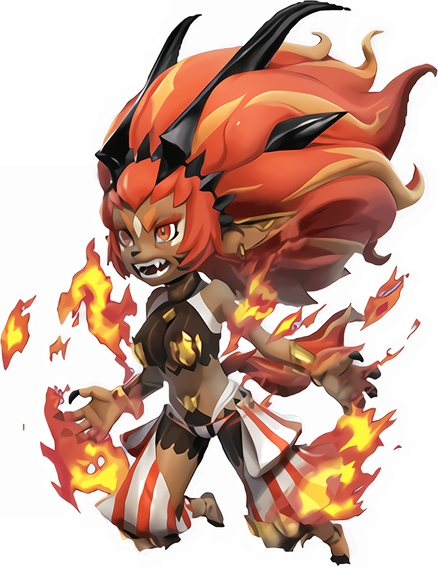
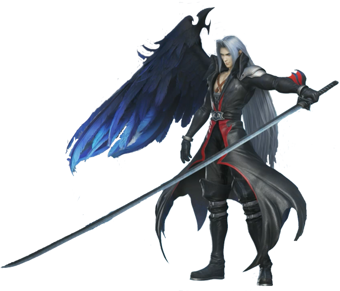
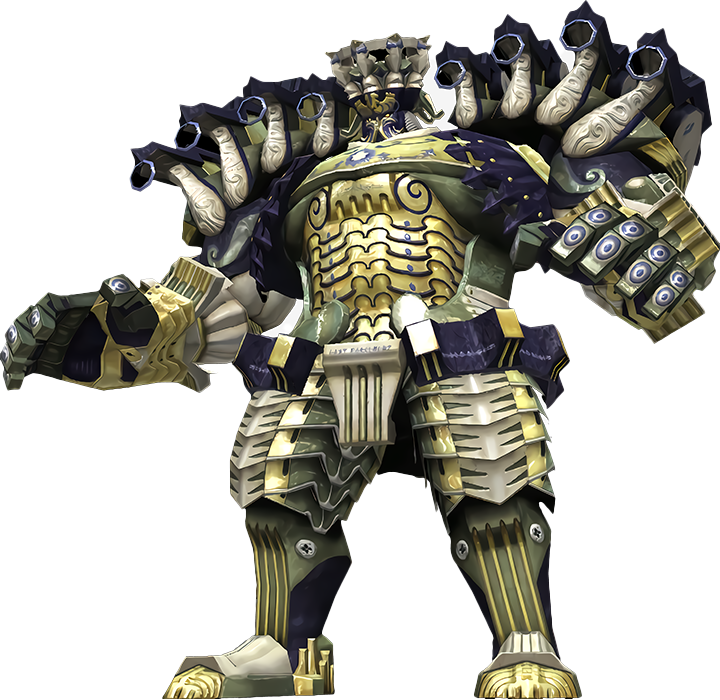
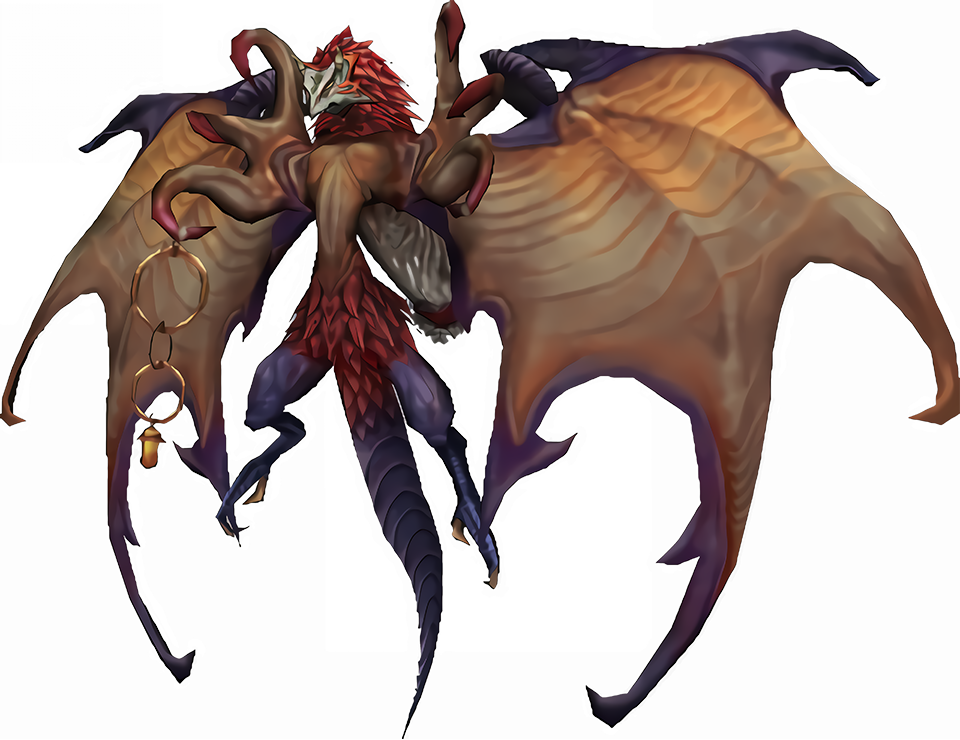

<style>

:root {
  --main-color:           #9B0719;
  --main-color-dark:      #0F6475;
  --main-color-light:     #5BB1C2;
  --main-color-lighter:   #D0E8ED;
  --main-color-lightest:  #F6FDFE;

  --main-color-stripe1:   #fbfbfb;
  --main-color-stripe2:   #f5f5f5;
}

.smallerRE {
    font-size: 5.5pt;
}

.smallerIT {
    font-size: 5.5pt;
    font-style: italic;
}

.phb .classTable h5,
.phb blockquote h5,

.phb .classTable {
    border: 3px solid var(--main-color);
    margin: 0em 0.2em 1.5em 0.2em;
    padding: 0 .5em;
    border-image: -webkit-linear-gradient(135deg, var(--main-color) 0%, var(--main-color-lightest) 50%, var(--main-color) 100%) 1;
    background: #fff;
    position: relative;
}

.phb .classTable:before, .phb .classTable:after {
    content: "";
    border: 3px solid var(--main-color);
    position: absolute;
    z-index: -1;
    display: inline-block;
    padding: 12px;
}

.phb .classTable:before { top: -9px; left: -9px; }
.phb .classTable:after {bottom: -9px; right: -9px; }

.phb{
	width : 210mm;
	height : 297mm;
	padding: 8mm;
	column-gap: 4mm;
}

/** Import Fonts **/
@import url('https://fonts.googleapis.com/css?family=IM+Fell+English');
@import url('https://fonts.googleapis.com/css?family=Uncial+Antiqua');
/** Defining fonts **/
@font-face {
	font-family: 'First Order';
	src: url('https://groumy.github.io/homebrewery-sotdl/fonts/firstv2.ttf')
}
@font-face {
	font-family: 'GothamBold';
	src: url('https://groumy.github.io/homebrewery-sotdl/fonts/GothamBold%20Regular.otf')
}
@font-face {
	font-family: 'GothamBook';
	src: url('https://groumy.github.io/homebrewery-sotdl/fonts/GothamBook%20Regular.otf')
}
@font-face {
	font-family: 'JSL Ancient';
	src: url('https://groumy.github.io/homebrewery-sotdl/fonts/jancieni.ttf')
}
@font-face {
	font-family: 'Poison Hope';
	src: url('https://groumy.github.io/homebrewery-sotdl/fonts/PoisonHope-Regular.otf')
}

/**	**/

.phb#p1:after {
	background: none;
	background-image: none;
	content:"";
}


.phb:nth-last-child(1):after {
	background: none;
	background-image: none;
	content:"";
}

.phb:after {
	background: none;
	background-image: url('https://groumy.github.io/homebrewery-sotdl/images/page-number-pentagram.png');
	background-size: 90px 90px;
	background-repeat: no-repeat;
	background-position: 0px calc(100% - 0px);
	height: 90px;
}

.phb {
	font-family: Athelas;
	background: url('D:/Users/Danno/Documents/dmbinder/aigr/source/imgs/sotdl-background-small.jpg');
	background-size: 100% 100%;
	background-repeat: no-repeat;
}

.phb h1{
	font-family: "First Order";
	font-size: 220%;
	text-align: center;
	text-shadow: 0px 0px 5px black;
	color:white;
	text-transform: uppercase;
	background-image: url('https://groumy.github.io/homebrewery-sotdl/images/h1.banner-large.png');
	background-size: 100% 102.5%;
	padding-top: 0.45em;
	padding-bottom : 25px;
	margin-left : 1mm;
	margin-right : 0mm;
	margin-top : -1mm;
	-webkit-font-smoothing: antialiased;
}

.phb h1+p::first-letter {
	float: inherit;
	font-family: inherit;
	font-size: inherit;
	color: inherit;
	line-height: inherit;
}

.phb h2,.phb h3,.phb h4,.phb h5,.phb h6,.phb h7 {
	font-family: "Portmanteau",'IM Fell English';
	text-transform : uppercase;
	text-align: left;
	color: rgb(155,7,25);
	font-weight: 400;
	line-height: 1.05;
}

.phb h2{
	font-size: 140%;
}

.phb h3{
	font-size: 120%;
	border-bottom-style: none;
        margin-top:auto;
        margin-bottom:auto;
        line-height: 1;
}

.phb h4{
	font-size: 115%;
}

.phb h5{
	font-size: 110%;
	border-bottom-style: solid;
	border-bottom-color: black;
	border-bottom-width: 1px;
}

.phb h6{
	font-size: 105%;
	border-bottom-style: solid;
	border-bottom-color: black;
	border-bottom-width: 1px;
	color: black;
}

.phb p, .phb li, .phb ol{
	font-family: 'GothamBook';
	font-size: 7.5pt;
    text-align: left;
    padding-right: 1mm;
    padding-left: 1.1mm;
}

.phb table thead th {
	background-color: #000000;
	color: #ffffff;
	font-family: "GothamBook";
	font-size:.85em;
	padding-top: 3px;
	padding-bottom: 3px;
}
.phb table tbody tr{
	font-family: "GothamBook";
	font-size:.85em;
}

.phb table tbody tr:nth-child(odd){
	background-color: initial;
	font-family: "GothamBook";
	font-size:.85em;
}

.phb table tbody tr:nth-child(even) {
	background-color: #fff;
	font-family: "GothamBook";
	font-size:.85em;
}

.phb strong em, .phb em strong{
	color: rgb(155,7,25);
	font-style : normal;
	font-weight: bold;
}

.phb blockquote{
	border-image: url('https://groumy.github.io/homebrewery-sotdl/images/parchment.png') 50 round;
	background-color: transparent;
	background-image: url('https://groumy.github.io/homebrewery-sotdl/images/parchment-back.png');
	box-shadow: none;
	padding-left: 20px;
	padding-right:20px;
	padding-top:10px;
}

.phb blockquote h5{
	border: none;
	text-align: center;
	padding-bottom: 10px;
}

.phb blockquote p{
	font-size:0.83em;
}

.phb .descriptive{
	border: none;
	background-color: transparent;
	box-shadow: none;
	font-style: italic;
	padding-left:30px;
}

.phb .descriptive h5{
	font-style:normal;
	color:black;
	text-align:center;
}

.phb .footnote{
	color:black;
	font-family: "First Order";
	font-size: 2.5em;
	width:100%;
	bottom:0px;
}

.phb .pageNumber {
	margin-bottom:6px;
	vertical-align: middle;
	font-size: 12pt;
	color: rgb(155,7,25);
	margin-right:0mm;
	margin-left:0mm;
	margin-top:2mm;
}

.phb .pageNumber.auto{
	bottom:20px;
}

.phb .pageNumber.auto::after{
	height:20px;
}

.phb .pageNumber.auto p{
	font-family: "First Order";
	font-size: 12pt;
	color: black;
	text-align: center;
}

.phb .pageNumber p{
	font-family: "First Order";
	font-size: 12pt;
	color: black;
	text-align: center;
}

.html-code code{
	visibility: visible;
	box-shadow: 1px 1px 1px black;
	background-color: #000;
	font-family: 'Lucida Console'
}

.phb hr{
	visibility: invisible;
	border-style : solid;
	border-color: black;
	border-width: 1px 0px 0px 0px;
	position: relative;
}

.phb p+hr{
	top: -5px;
}


.phb .spell h4{
	font-size: 0.5em;
}

.phb:nth-child(odd):after {
	transform: scaleX(-1);
}

.phb:nth-child(even):after {
	transform: scaleX(1);
}


/** Monster Stat Block **/

.phb hr+blockquote{
	padding : 0px;
}

.phb hr+blockquote h1{
	font-family : Athelas;
	background-color: black;
	background-image : none;
	color : white;
	font-weight: bold;
	font-size: 1em;
	padding: 5px;
	float:left;
	margin: 0px;
	width:60%;
	text-align: left;
}

.phb hr+blockquote h2{
	font-family : Athelas;
	background-color: black;
	color : white;
	font-weight: bold;
	font-size: 1.2em;
	padding: 5px;
	float:left;
	width: 100%;
	margin : 0px;
	text-align:left;
}

.phb hr+blockquote h3{
	background-color: #BBB;
	color: black;
	padding: 3px;
	padding-left: 5px;
	font-size: 0.8em;
	font-family: 'GothamBook';
	font-weight: bold;
	border-style : none;
}

.phb hr+blockquote h2+p{
	clear : both;
	background-color : darkred;
	color: white;
	padding : 3px;
	padding-left: 5px;
}

.phb hr+blockquote h2+p+hr,
.phb hr+blockquote h3+hr{
	display:none;
}

.phb hr+blockquote hr+ul li {
	margin-left: 5px;
	font-family: Athelas;
}

.phb hr+blockquote hr {
	background-image : none;
	visibility: visible;
	border-style: solid;
	border-color: black;
	border-width: 1px 0px 0px 0px;
	position: relative;
}

  .toc a {
    color: inherit !important;	/*toc specifically wants black text. This resets the headers*/
    font-size:8.5pt;
  }

  .toc li span:nth-child(2){	/*Allow dot leaders to fill remaining space but not overlap*/
    width: auto;
    overflow: hidden;
    white-space: nowrap;
    display: block;
  }

  .toc li span:nth-child(2):after{
    font-family		: "Portmanteau",'IM Fell English';	/*Remove any header styles from dot leaders*/
    font-size   	: 5pt;
    font-weight		: normal;
    color			: black;
    content:
      " ........................................."
      ".........................................."
      ".........................................."
      ".........................................."
      "..........................................";
  }

  .toc li span:first-child{
    float: right;
    font-family		: "Portmanteau",'IM Fell English';	/*Remove any header styles from page numbers*/
    font-size   	: 8.5pt;
    font-weight		: normal;
    color			: black;
	margin-left		: 1px;	/*Leaves a small space between page numbers and dot leaders*/
	margin-right:-0mm;
  }

/*Special cases for headings*/
  .toc li h3 span:nth-child(2):after{
  	content: " ";						/*Remove dot leaders on h3*/
  }

  .toc li h3 {
    margin-bottom: 4px !important;		/*Special spacing for h3*/
    margin-top: 10px !important;
    line-height: initial !important;	/*For some reason Multi-line h3 line spacing changed*/
	font-size:8.5pt;
	margin-right:0mm;
  }

.toc li h4 {
	margin-bottom: 4px !important;		/*Special spacing for h3*/
    margin-top: 10px !important;
    line-height: initial !important;	/*For some reason Multi-line h3 line spacing changed*/
	font-size:8.5pt;
	margin-right:0mm;
  }

  .toc li h3 span:first-child{
  	line-height: 1.8em !important;  	/*Line page numbers up with Multi-line h3 better*/
	font-size:8.5pt;
	margin-right:-0mm;
  }

  .toc ul ul {
  	margin-left: 10px !important;		/*Original lists intented too much*/
    margin-right: -4px !important;
  }

  .toc>ul>li {
	margin-bottom: initial !important;	/*margin for list items needs to be removed or 0*/
	margin-right:0mm;
  }

.phb table {
  font-size: 9pt;
  margin-bottom:auto;
}

</style>

# Espers in Adventures in Gaia &mdash; Reborn

## Rules

* A player may summon their Esper at a rate of half the summoner's Proficiency bonus per day, recharging at dawn.
* An Esper lasts, at most, 1 minute, or until they run out of charges to spend on Esper Actions.
* A Summoner has as many charges as the summoner's character level.
* A Summoner uses their class' spellcasting ability modifier for some of their Esper's abilties. A Summoner without a spellcasting ability uses the summoner's highest mental ability.
* An Esper's attacks count as magical.


\page

___
> ## TITAN
>*Large elemental (Esper), unaligned*
> ___
> - **Armor Class** AC 16 + half the summoner’s level (natural armor)
> - **Hit Points** equal to fifteen times the sum of the esper’s Constitution modifier + the summoner’s spellcasting ability modifier + the summoner’s level
> - **Speed** 40 feet
>___
>|STR|DEX|CON|INT|WIS|CHA|
>|:---:|:---:|:---:|:---:|:---:|:---:|
>|25 (+7)|12(+1)|20(+5)|6(-2)|11(+0)|10(+0)|
>___
> - **Saving Throws** half the level of the summoner + Stat Modifier
> - **Damage Vulnerabilities** poison
> - **Damage Resistances** acid
> - **Senses** passive Perception 10 + summoner's proficiency bonus
> - **Languages** understands the languages of its summoner, Terran
> ___
>
> ### Actions
> (1 Charge) ***Clobber.*** *Melee Attack:* +7 + half the summoner’s level to hit, reach 10 ft, one target. *Hit:* 18 (or 2d10+7) bludgeoning damage, and the target is knocked prone.
>
> (3 Charges) ***Earthern Fury.*** Creatures you choose within 50 feet of Titan must make a DC 15 + half the summoner’s level Constitution saving throw. On a failed save, they suffer 35 (or 10d6) acid damage and are knocked prone, or half as much damage and remain standing on a successful one.

*&ldquo;Titan, a great giant who rends the very earth asunder. The great chasms he creates in the ground can swallow up armies of soldiers.&rdquo;*

```
```


\page
___
> ## SHIVA
>*Medium fey (Esper), unaligned*
> ___
> - **Armor Class** 13 + half the summoner’s level (natural armor)
> - **Hit Points** equal to ten times the sum of the esper’s Constitution modifier + the summoner’s spellcasting ability modifier + the summoner’s level
> - **Speed** 30 ft., fly 40 ft.
>___
>|STR|DEX|CON|INT|WIS|CHA|
>|:---:|:---:|:---:|:---:|:---:|:---:|
>|10 (+0)|16(+3)|15(+2)|15(+2)|18(+4)|19(+4)|
>___
> - **Saving Throws** half the level of the summoner + Stat Modifier
> - **Damage Vulnerabilities** fire
> - **Damage Resistances** cold
> - **Senses** darkvision 60 ft., passive Perception 14 + summoner's proficiency bonus
> - **Languages** understands the languages of its summoner, Fey, Aquan
> ___
>
> ### Actions
> (1 Charge) ***Icy Stare.*** *Ranged Attack:* +4 + half the summoner’s level to hit, range 50 ft, one target. *Hit:* 18 (or 4d6+4) cold damage.
>
> (2 Charges) ***Diamond Dust.*** Creatures you choose within a 60 foot cone must make a DC 10 + half the summoner’s level Constitution saving throw. On a failed save, they suffer 31 (or 6d8+4) cold damage, or half as much damage on a successful one.

*&ldquo;The empress of ice, wreathed in frost. She is known for her signature move, 'Diamond Dust', which freezes everything in an instant.&rdquo;*

```
```


\page

___
> ## IFREETA
>*Medium demon (Esper), unaligned*
> ___
> - **Armor Class** 14 + half the summoner’s level (natural armor)
> - **Hit Points** equal to ten times the sum of the esper’s Constitution modifier + the summoner’s spellcasting ability modifier + the summoner’s level
> - **Speed** 30 ft., fly 50 ft.
>___
>|STR|DEX|CON|INT|WIS|CHA|
>|:---:|:---:|:---:|:---:|:---:|:---:|
>|18 (+4)|18 (+4)|16 (+3)|10 (+0)|14 (+2)|16 (+3)|
>___
> - **Saving Throws** half the summoner’s level + Stat Modifier
> - **Damage Vulnerabilities** cold
> - **Damage Immunities** fire
> - **Condition Immunities** charmed, frightened
> - **Senses** darkvision 60 ft., passive Perception 12 + summoner's proficiency bonus
> - **Languages** understands the languages of its summoner, Celistial, Ignan
> ___
>
> ### Actions
> (1 Charge) ***Fire Claw.*** *Melee Attack:* +4 + half the summoner’s level to hit, reach 5ft, one target. *Hit:* 16 (or 2d10+5) fire damage.
>
> (2 Charges) ***Crimson Cyclone.*** Creatures you choose within 30 feet of Ifreeta must make a DC 12 + half the summoner’s level Constitution saving throw. On a failed save, they suffer 39 (or 8d6+3) fire damage, or half as much damage on a successful one.

*&ldquo;An exceptionally rare female efreet who's unpredictable and spectacular magical powers cow all before her.&rdquo;*

```
```



\page

___
> ## BAHAMUT
>*Huge dragon (Esper), unaligned*
> ___
> - **Armor Class** AC 15 + half the summoner’s level (natural armor)
> - **Hit Points** equal to fifteen times the sum of the esper’s Constitution modifier + the summoner’s spellcasting ability modifier + the summoner’s level
> - **Speed** 50 ft., fly 150 ft.
>___
>|STR|DEX|CON|INT|WIS|CHA|
>|:---:|:---:|:---:|:---:|:---:|:---:|
>|25 (+7)|25(+7)|25(+7)|20(+5)|20(+5)|20(+5)|
>___
> - **Saving Throws** the summoner’s level + Stat Modifier
> - **Damage Vulnerabilities** &mdash;
> - **Damage Resistances** force, bludgeoning, slashing, piercing
> - **Senses** Passive Perception 15 + summoner's proficiency bonus
> - **Languages** understands the languages of its summoner, Celestial, Draconic
> ___
>
> ***Flyby.*** Bahamut doesn't provoke opportunity attacks when it flies out of an enemy's reach.
>
> ### Actions
> (1 Charge) ***Dragon Claws.*** *Melee Attack:* +5 + half the summoner’s level to hit, reach 10 ft, one target. *Hit:* 16 (or 2d10+5) slashing damage. This attack can target up to 3 creatures in range.
>
> (3 Charges) ***Mega Flare.*** Pick a location within 100 feet. Creatures you choose within a 10 feet of that point must make a DC 15 + half the summoner’s level Constitution saving throw. On a failed save, they suffer 70 (or 10d12+5) force damage, or half as much damage on a successful one.
>
> (5 Charges) ***Giga Flare.*** Pick a location within 100 feet. Creatures you choose within a 15 feet of that point must make a DC 15 + half the summoner’s level Constitution saving throw. On a failed save, they suffer 102 (or 15d12+5) force damage, or half as much damage on a successful one.

*&ldquo;Conqueror of the skies, Bahamut has known many names; the Dragon King, the Hallowed Father, the First Sire.&rdquo;*

```
```


\page

___
> ## RAMUH
>*Medium humanoid (Esper), unaligned*
> ___
> - **Armor Class** AC 13  + half the summoner’s level (natural armor)
> - **Hit Points**  equal to ten times the sum of the esper’s Constitution modifier + the summoner’s spellcasting ability modifier + the summoner’s level
> - **Speed** 30 feet
>___
>|STR|DEX|CON|INT|WIS|CHA|
>|:---:|:---:|:---:|:---:|:---:|:---:|
>|10 (+0)|16(+3)|15(+2)|15(+2)|18(+4)|19(+4)|
>___
> - **Saving Throws** half the summoner’s level + Stat Modifier
> - **Damage Vulnerabilities** thunder
> - **Damage Resistances** lightning
> - **Senses** Passive Perception 14 + summoner's proficiency bonus
> - **Languages** understands the languages of its summoner, Auran, Celestial
> ___
>
> ### Actions
> (1 Charge) ***Spark Strike.*** *Ranged Attack:* +4 + half the summoner’s level to hit, range 50 ft., one target. *Hit:* 26 (or 4d10+4) lightning damage
>
> (2 Charges) ***Judgement Bolt.*** Pick a location within 50 feet. Creatures you choose within a 20 feet of that point must make a DC 12 + half the summoner’s level Constitution saving throw. On a failed save, they suffer 37 (or 6d10+4) lightning damage, or half as much damage on a successful one.

*&ldquo;An ancient, ageless mage bearing the dazzling power of lightning.&rdquo;*

```
```


\page

___
> ## DIABOLOS
>*Large devil (Esper), unaligned*
> ___
> - **Armor Class** AC 13 + half the summoner’s level (natural armor)
> - **Hit Points** equal to fifteen times the sum of the esper’s Constitution modifier + the summoner’s spellcasting ability modifier + the summoner’s level
> - **Speed** 30 ft., fly 150 ft.
>___
>|STR|DEX|CON|INT|WIS|CHA|
>|:---:|:---:|:---:|:---:|:---:|:---:|
>|16 (+4)|16(+3)|16(+3)|18(+4)|18(+4)|20(+5)|
>___
> - **Saving Throws** the summoner’s level + Stat Modifier
> - **Damage Vulnerabilities** radiant
> - **Damage Resistances** necrotic
> - **Senses** Passive Perception 14 + summoner's proficiency bonus
> - **Languages** understands the languages of its summoner, Infernal, Abyssal
> ___
>
> ### Actions
> (1 Charge) ***Nether Blast.*** *Ranged Attack:* +5 + half the summoner’s level to hit, range 40 ft./120 ft., one target. *Hit:* 16 (or 2d10+5) necrotic damage. This attack can target up to 3 creatures in range.
>
> (3 Charges)***Ruinous Omen.*** Pick a location within 100 feet. Creatures you choose within a 15 feet of that point must make a DC 13 + half the summoner’s level Constitution saving throw. On a failed save, they suffer 60 (or 10d10+5) necrotic damage, or half as much damage on a successful one.

*&ldquo;Pitiful creature, why dost thou call my name? I am both darkness eternal and the deep sin of the light.&rdquo;*

```
```


\page

___
> ## Hades
>*Large undead (Esper), unaligned*
> ___
> - **Armor Class** 12 + half the summoner’s level (natural armor)
> - **Hit Points** equal to ten times the sum of the esper’s Constitution modifier + the summoner’s spellcasting ability modifier + the summoner’s level
> - **Speed** 30 ft.
>___
>|STR|DEX|CON|INT|WIS|CHA|
>|:---:|:---:|:---:|:---:|:---:|:---:|
>|20 (+5)|14 (+2)|16 (+3)|10 (+0)|14 (+2)|16 (+3)|
>___
> - **Saving Throws** half the level of the summoner + Stat Modifier
> - **Damage Vulnerabilities** acid
> - **Damage Immunities** poison
> - **Condition Immunities** charmed, frightened
> - **Senses** darkvision 60 ft., passive Perception 12 + summoner's proficiency bonus
> - **Languages** understands the languages of its summoner, Infernal
> ___
>
> ### Actions
> (1 Charges) ***Cauldron Slam.*** *Melee Attack:* +5 + half the summoner’s level to hit, reach 5 ft., one target. Hit: 18 (or 3d8+5) bludgeoning damage.
>
> (2 Charges) ***Black Cauldron.*** Creatures you choose within 30 feet of Hades must make a DC 11 + half the summoner’s level Constitution saving throw. On a failed save, they suffer 39 (or 8d8+3) poison damage, or half as much damage on a successful one. For every 3 points the save fails by, roll a d6, rerolling already rolled numbers. The target is subject to a condition from the following list:
> |D6|Effect|
> |:---:|:---|
> |1|Blinded|
> |2|Petrified|
> |3|Poisoned|
> |4|Unconscious|
> |5|Stunned|
> |6|the effects of the Confusion spell.|

*&ldquo;To face me is to face thy deepest, darkest nightmares!&rdquo;*

```
```


\page

___
> ## FALSE ANGEL
>*Medium humanoid (Esper), unaligned*
> ___
> - **Armor Class** AC 17 + half the summoner’s level (natural armor)
> - **Hit Points** equal to twelve times the sum of the esper’s Constitution modifier + the summoner’s spellcasting ability modifier + the summoner’s level
> - **Speed** 50 ft., fly 80 ft.
>___
>|STR|DEX|CON|INT|WIS|CHA|
>|:---:|:---:|:---:|:---:|:---:|:---:|
>|25 (+7)|25(+7)|27(+7)|20(+5)|20(+5)|27(+8)|
>___
> - **Saving Throws** the summoner’s level + Stat Modifier
> - **Damage Vulnerabilities** &mdash;
> - **Damage Resistances** psychic
> - **Senses** Passive Perception 15 + summoner's proficiency bonus
> - **Languages** understands the languages of its summoner
> ___
>
> ***Flyby.*** False Angel doesn't provoke opportunity attacks when it flies out of an enemy's reach.
>
> ### Actions
>
> (1 Charge) ***Masamune.*** *Melee Attack:* +7 + half the summoner’s level to hit, reach 10 ft, one target. *Hit:* 11 (or 1d8+7) slashing damage.
>
> (3 Charges) ***Octoslash.*** *Melee Attack:* +7 + half the summoner’s level to hit, reach 10 ft, one target. *Hit:* 43 (or 8d8+7) slashing damage.
>
> (5 Charges) ***Supernova.*** Pick a location within 100 feet. Creatures you choose within a 15 feet of that point must make a DC 16 + half the summoner’s level Constitution saving throw. On a failed save, they suffer 105 (or 15d12+8) damage, or half as much damage on a successful one.
>
> ### Bonus Actions
> (1 Charge) ***Despair.*** as the *Vicious Mockery* cantrip.

*&ldquo;Shall I give you despair?&rdquo;*

```
```



\page

___
> ## ALEXANDER
>*Huge construct (Esper), unaligned*
> ___
> - **Armor Class** AC 20 + half the summoner’s level (natural armor)
> - **Hit Points** equal to twelve times the sum of the esper’s Constitution modifier + the summoner’s spellcasting ability modifier + the summoner’s level
> - **Speed** 40 ft.
>___
>|STR|DEX|CON|INT|WIS|CHA|
>|:---:|:---:|:---:|:---:|:---:|:---:|
>|25 (+7)|18(+4)|22(+6)|20(+5)|27(+8)|20(+5)|
>___
> - **Saving Throws** the summoner’s level + Stat Modifier
> - **Damage Vulnerabilities** necrotic
> - **Damage Resistances** radiant, bludgeoning, slashing, piercing
> - **Senses** Passive Perception 18 + summoner's proficiency bonus
> - **Languages** understands the languages of its summoner, Celestial
> ___
>
> ### Actions
>
> (1 Charge) ***Hammerfist.*** *Melee Attack:* +7 + half the summoner’s level to hit, reach 10 ft, one target. *Hit:* 18 (or 2d10+7) bludgeoning damage.
>
> (3 Charges) ***Banish Breath.*** Creatures you choose within a 60 foot cone must make a DC 16 + half the summoner’s level Constitution saving throw. On a failed save, they suffer 35 (or 5d10+8) radiant damage, or half as much damage on a successful one.
>
> (5 Charges) ***Divine Judgement.*** Pick a location within 100 feet. Creatures you choose within a 25 feet of that point must make a DC 16 + half the summoner’s level Constitution saving throw. On a failed save, they suffer 112 (or 16d12+8) radiant damage, or half as much damage on a successful one.

*&ldquo;An ancient weapon imbued with a sacred power.&rdquo;*

```
```



\page

___
> ## VALEFOR
>*Large dragon (Esper), unaligned*
> ___
> - **Armor Class** AC 16 + half the summoner’s level (natural armor)
> - **Hit Points** equal to twelve times the sum of the esper’s Constitution modifier + the summoner’s spellcasting ability modifier + the summoner’s level
> - **Speed** 25 ft., fly 180 ft.
>___
>|STR|DEX|CON|INT|WIS|CHA|
>|:---:|:---:|:---:|:---:|:---:|:---:|
>|16 (+3)|23(+6)|22(+6)|16(+3)|18(+4)|18(+4)|
>___
> - **Saving Throws** the summoner’s level + Stat Modifier
> - **Damage Vulnerabilities** lightning
> - **Damage Resistances** thunder
> - **Senses** Passive Perception 16 + summoner's proficiency bonus
> - **Languages** understands the languages of its summoner, Celestial
> ___
>
> ***Flyby.*** Valefor doesn't provoke opportunity attacks when it flies out of an enemy's reach.
>
> ### Actions
>
> (1 Charge) ***Sonic Wings.*** *Melee Attack:* +8 + half the summoner’s level to hit, reach 10 ft, one target. *Hit:* 8 (or 2d4+3) slashing damage, and the target must make a DC 12 + half the summoner’s level Constitution saving throw, or be affected as if under the *Slow* spell.
>
> (3 Charges) ***Energy Ray.*** Pick a location within 50 feet. Creatures you choose within a 15 feet of that point must make a DC 12 + half the summoner’s level Constitution saving throw. On a failed save, they suffer 34 (or 8d6+6) thunder damage, or half as much damage on a successful one.
>
> (5 Charges) ***Energy Blast.*** Pick a location within 100 feet. Creatures you choose within a 25 feet of that point must make a DC 12 + half the summoner’s level Constitution saving throw. On a failed save, they suffer 83 (or 14d10+6) thunder damage, or half as much damage on a successful one.

*&ldquo;A spirit-beast forever loyal to those who summon it.&rdquo;*

```
```

