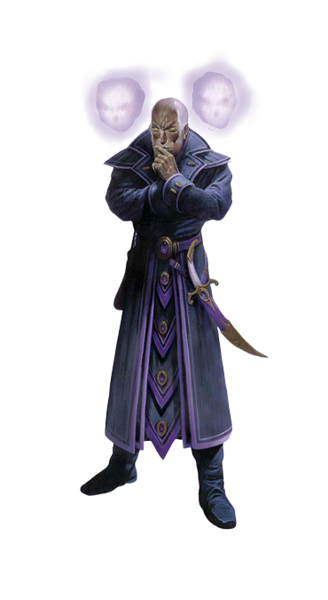

## Synad

<div class='descriptive'>

"I DON'T THINK THIS THING IS HUMAN..."

*Alyk whispered to his companion. They had traveled for days to reach the hermit, fabeled to cure the affliction which had plagued Alyk's elven mind for days now.  Finally, reaching this creature's secluded hovel, they sat before him in the mid-day light as it whispered to itself only a few feet away, gazing into a multifaceted crystal.  The creature gave off the impression of humanity... yet to Alyk and Jinna the movements and interactions seemed practiced; as if the creature had watched humans for many years as an actor studies a role...*  

*"It doesn't quite... talk like us does it?" Jinna replied, "I've heard it speak in two, maybe even three voices so far."*

*The pair halted their conversation as the hermit ceased his muttering, standing up in an awkward, almost animated way.  He gave a semblance of a smile to the elf and the human as he spoke.*

*"I have devised a potion.  It should ease the pain.  And also your mind."  It said to them in its stilted manner of speech. The creature's pale skin glinted oddly in the light as it turned around to the oaken table behind him, searching through a number of vials.  Alyk nudged his friend, unable to speak as horror crept over him.  At the edge of the light in the room, where shadows covered him, two faces on either side of the creature stared back at them with that same practiced smile.*
  
</div>

A typical Synad is almost indistinguishable from a normal human or elf, living amongst their societies and adopting their cultures.  These creatures may appear slightly aloof or unsocial, but in fact Synads are three independent minds inhabiting the same body, acting as a cooporative whole led by the Overmind.  Whereas most other races crave social interaction, a Synad is perfectly content conversing with its other minds.  Each mind has its own thoughts and feelings separate from the whole, able to give unique perspectives and multiple viewpoints on the same topic. 

### The Minds of a Synad
A synad is composed of three unique minds all inhabiting the same host body: The Overmind, The Oracle, and the Collective.  Each of these minds has its own traits, personality, and thoughts

#### The Overmind
The Overmind of a synad is the foremost, handling all concious actions such as walking, speaking, or fighting.  This is the synad's middle head, the only one to appear in physical form at all times.  The Overmind is governed by pure logic, thinking mainly in terms of absolutes.


````
````

#### The Oracle
The Oracle mind is more subdued, dictacting the reasoning and emotions of a synad.  The Oracle is considered the wisest of the heads, storing the synad's long term memories and experiences.  The Oracle may provide advice to the Overmind about past experiences or memories, providing valuable insight into the actions a synad should take in any situation.

#### The Collective
The Collective Mind is known as the "passive mind."  This mind acts as a bridge between the other two minds, accessing ancient psionic networks of synad knowledge.  Though a difficult and mentally straining task, this mind can access information perceived by the minds of all other synads.

### Secluded Lives
In the bright light of day, a synad passes for a tall, slim, almost featureless human.  However, creatures may perceive the Synad to have three heads out of the corner of their eyes: a central one appearing humanoid, and two additional ethereal heads on either side of it.  This effect is more noticeable if the Synad is in dim light, or is tired from a day's events.  Given the Synad's desire to blend in with normal society, they may seek to avoid gloomy areas or social interaction altogether. 

Though uncommon, a synad may reveal their heritage to a close companion or friend, but this act requires immense trust from both parties. </br> If a synad is discovered </br> without this act of trust, </br> they may seek to flee </br> or become hostile




\page

### Ecletcic Interests 
Synads mix with races and cultures across the world, taking pleasure in experiencing activities others enjoy, or learning about the history of various socieities.  This variety of knowledge and interest a synad aquires throughout its life can shape the way it thinks and acts, giving it a wildly varied personality and alignment.  This interest also provides the Synad with a sense of adventure and intrigue, desiring to see the world and experience new and unusual things.

### Creatures from Beyond
Synads hail from a parallel world accessible through the Plane of Shadow.  The few who dwell on the Material Plane prefer to forget their world of origin, claiming that monstrosities of the mind roam there unhindered.

### Synad Names
Synad names vary greatly, mainly because synads have thrown off their original ways and adopted human culture. They draw their names from the names of humans in the area where they have settled. Synads who mate and produce children often name them after local heroes or great leaders.

### Synad Traits
Your synad character manifests physical attributes similar to all other synads 

***Ability Score Increase:*** Your Intelligence, Wisdom, and Charisma scores all increase by 1, representing your Overmind, Oracle, and Collective minds respectively

***Age:*** Synads age roughly half as fast as humans do, reaching maturity around 20 to 30 years old, and live up to about two centuries

***Alignment:*** Synads do not tend toward any particular alignment.  The best and the worst are found among them.

***Size:*** Synads typically stand just over 6 feet tall and weigh about
170 pounds, with males somewhat taller and heavier than
females. Synads are typically hairless. They have pale skin,
large, dark eyes, and long, expressive fingers. Your size is Medium.

***Speed:*** Your base walking speed is 30 feet.

***Abberant Form:*** You count as an abberation for the purpose of spells and class features which detect such creatures.

***Darkvision:*** You have superior vision in dark and dim conditions. You can see in dim light within 60 feet of you as if it were bright light, and in darkness as if it were dim light. You can't discern color in darkness, only shades of grey.


***Threefold Mind:*** You may empower the capabilities of one of your minds, choosing either the Overmind, the Oracle, or the Collective for 1 minute.  Once you have used this feature, you may not do so again until after completing a long rest.

* ***Overmind:*** Empowering the Overmind allows it to almost precognitively process information happening around it, enhancing the synad's physical adaptability.  While this mind is empowered, you may grant a +1 bonus to one initiative roll, attack roll, or saving throw.  You may apply this bonus no more than once on each of your turns.  You may declare the use of this feature before or after you make any roll, but before the DM declares the result.  
 
* ***Oracle:*** Empowering the Oracle allows the synad to more easily evaluate and adapt to their emotions.  While this mind is empowered, you gain advantage on Wisdom saving throws, and Wisdom (insight) checks

* ***Collective:*** Empowering the Collective allows it to more easily access the network of synad history, allowing the mind to almost perfectly recollect events. While this mind is empowered, you gain advantage on all Intelligence checks made to recall information.

***Unified Thoughts:*** A synad's threefold mind allows it to subconciously communicate with any of its other minds, and constantly share thoughts and perceptions.  You do not need to sleep to gain the benefits of a long rest as other races do.  Instead, you may spend at least 6 hours in a deep meditative state, during which you discuss the events of the day with your other minds.  You appear asleep while in this state, but it does not render you unconcious.

***Languages:*** You can speak, read, and write Common, Deep Speech, and Vayasesha.


<div style='margin-bottom:500px'></div>

##### Image Credits
"Synad" - From: "Dungeons & Dragons Complete Psionic; Mastering the Powers of the Mind"

Drawn by Wayne England, David Griffith, Jon Hodgson, Ralph Horsley, Warren Mahy, William O'Connor, Ted Pednergraft, Richard Sardinha, Ron Spencer