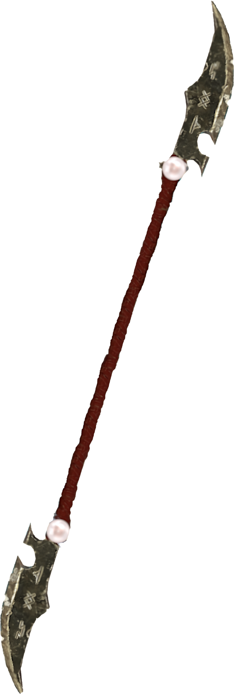
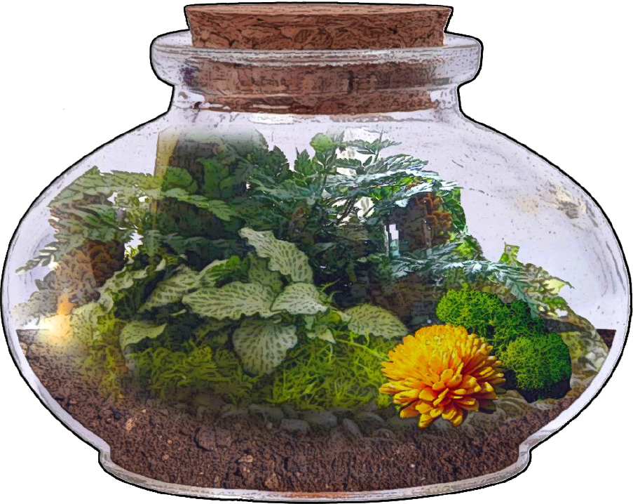
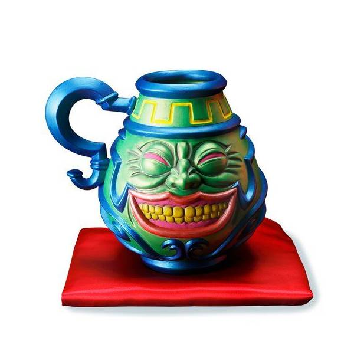
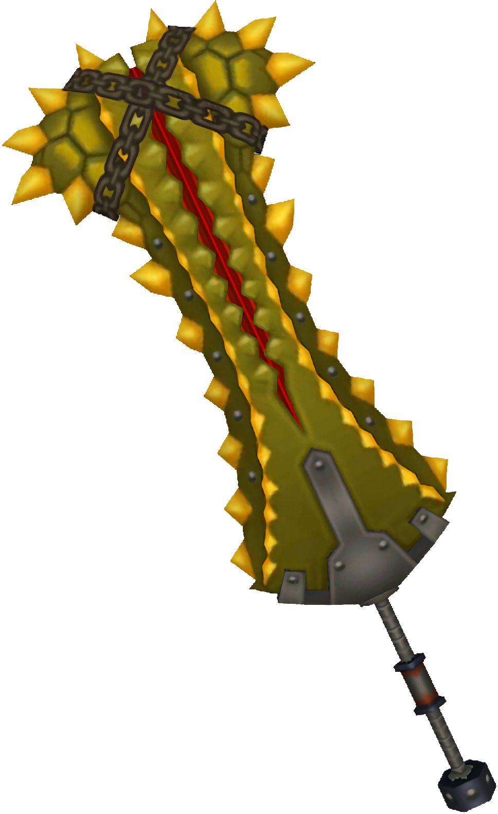

<style>

:root {
 --main-color:      #9B0719;
 --main-color-dark:   #0F6475;
 --main-color-light:   #5BB1C2;
 --main-color-lighter:  #D0E8ED;
 --main-color-lightest: #F6FDFE;

 --main-color-stripe1:  #fbfbfb;
 --main-color-stripe2:  #f5f5f5;
}

.smallerRE {
  font-size: 5.5pt;
}

.smallerIT {
  font-size: 5.5pt;
  font-style: italic;
}

.phb .classTable h5,
.phb blockquote h5,

.phb .classTable {
  border: 3px solid var(--main-color);
  margin: 0em 0.2em 1.5em 0.2em;
  padding: 0 .5em;
  border-image: -webkit-linear-gradient(135deg, var(--main-color) 0%, var(--main-color-lightest) 50%, var(--main-color) 100%) 1;
  background: #fff;
  position: relative;
}

.phb .classTable:before, .phb .classTable:after {
  content: "";
  border: 3px solid var(--main-color);
  position: absolute;
  z-index: -1;
  display: inline-block;
  padding: 12px;
}

.phb .classTable:before { top: -9px; left: -9px; }
.phb .classTable:after {bottom: -9px; right: -9px; }

.phb{
	width : 210mm;
	height : 297mm;
	padding: 8mm;
	column-gap: 4mm;
}

/** Import Fonts **/
@import url('https://fonts.googleapis.com/css?family=IM+Fell+English');
@import url('https://fonts.googleapis.com/css?family=Uncial+Antiqua');
/** Defining fonts **/
@font-face {
	font-family: 'First Order';
	src: url('https://groumy.github.io/homebrewery-sotdl/fonts/firstv2.ttf')
}
@font-face {
	font-family: 'GothamBold';
	src: url('https://groumy.github.io/homebrewery-sotdl/fonts/GothamBold%20Regular.otf')
}
@font-face {
	font-family: 'GothamBook';
	src: url('https://groumy.github.io/homebrewery-sotdl/fonts/GothamBook%20Regular.otf')
}
@font-face {
	font-family: 'JSL Ancient';
	src: url('https://groumy.github.io/homebrewery-sotdl/fonts/jancieni.ttf')
}
@font-face {
	font-family: 'Poison Hope';
	src: url('https://groumy.github.io/homebrewery-sotdl/fonts/PoisonHope-Regular.otf')
}

/**	**/

.phb#p1:after {
	background: none;
	background-image: none;
	content:"";
}


.phb:nth-last-child(1):after {
	background: none;
	background-image: none;
	content:"";
}

.phb:after {
	background: none;
	background-image: url('https://groumy.github.io/homebrewery-sotdl/images/page-number-pentagram.png');
	background-size: 90px 90px;
	background-repeat: no-repeat;
	background-position: 0px calc(100% - 0px);
	height: 90px;
}

/*
.phb#p1 h1{
	font-family: "First Order";
	font-size: 300%;
	text-align: center;
	text-shadow: 0px 0px 5px black;
	color:white;
	text-transform: uppercase;
	background-image: url('https://groumy.github.io/homebrewery-sotdl/images/h1.banner-large.png');
	background-size: 100% 102.5%;
	padding-top: 0.45em;
	padding-bottom : 25px;
	padding-left : 10mm;
	padding-right : 10mm;
	margin-left : -100mm;
	margin-right : -100mm;
	margin-top : -1mm;
	-webkit-font-smoothing: antialiased;
}

.phb#p1 h2{
	font-family: "First Order";
	font-size: 150%;
	text-align: center;
	text-shadow: 0px 0px 5px black;
	color:white;
	text-transform: uppercase;
	background-image: url('https://groumy.github.io/homebrewery-sotdl/images/h1.banner-large.png');
	background-size: 100% 102.5%;
	padding-top: 0.45em;
	padding-bottom : 25px;
	padding-left : 10mm;
	padding-right : 10mm;
	margin-left : -100mm;
	margin-right : -100mm;
	margin-top : -1mm;
	-webkit-font-smoothing: antialiased;
}

.phb#p28 h1{
	font-family: "First Order";
	font-size: 200%;
	text-align: center;
	text-shadow: 0px 0px 5px black;
	color:white;
	text-transform: uppercase;
	background-image: url('https://groumy.github.io/homebrewery-sotdl/images/h1.banner-large.png');
	background-size: 100% 102.5%;
	padding-top: 0.45em;
	padding-bottom : 25px;
	padding-left : 10mm;
	padding-right : 10mm;
	margin-left : -100mm;
	margin-right : -100mm;
	margin-top : -1mm;
	-webkit-font-smoothing: antialiased;
}
*/

.phb {
	font-family: Athelas;
	background: url('D:/Users/Danno/Documents/dmbinder/aigr/source/imgs/sotdl-background-small.jpg');
	background-size: 100% 100%;
	background-repeat: no-repeat;
}

.phb h1{
	font-family: "First Order";
	font-size: 220%;
	text-align: center;
	text-shadow: 0px 0px 5px black;
	color:white;
	text-transform: uppercase;
	background-image: url('https://groumy.github.io/homebrewery-sotdl/images/h1.banner-large.png');
	background-size: 100% 102.5%;
	padding-top: 0.45em;
	padding-bottom : 25px;
	margin-left : 1mm;
	margin-right : 0mm;
	margin-top : -1mm;
	-webkit-font-smoothing: antialiased;
}

.phb h1+p::first-letter {
	float: inherit;
	font-family: inherit;
	font-size: inherit;
	color: inherit;
	line-height: inherit;
}

.phb h2,.phb h3,.phb h4,.phb h5,.phb h6,.phb h7 {
	font-family: "Portmanteau",'IM Fell English';
	text-transform : uppercase;
	text-align: left;
	color: rgb(155,7,25);
	font-weight: 400;
	line-height: 1.05;
}

.phb h2{
	font-size: 140%;
}

.phb h3{
	font-size: 120%;
	border-bottom-style: none;
    margin-top:auto;
    margin-bottom:auto;
    line-height: 1;
}

.phb h4{
	font-size: 115%;
}

.phb h5{
	font-size: 110%;
	border-bottom-style: solid;
	border-bottom-color: black;
	border-bottom-width: 1px;
}

.phb h6{
	font-size: 105%;
	border-bottom-style: solid;
	border-bottom-color: black;
	border-bottom-width: 1px;
	color: black;
}

.phb p, .phb li, .phb ol{
	font-family: 'GothamBook';
	font-size: 7.5pt;
  text-align: left;
  padding-right: 1mm;
  padding-left: 1.1mm;
}

.phb table thead th {
	background-color: #000000;
	color: #ffffff;
	font-family: "GothamBook";
	font-size:.85em;
	padding-top: 3px;
	padding-bottom: 3px;
}
.phb table tbody tr{
	font-family: "GothamBook";
	font-size:.85em;
}

.phb table tbody tr:nth-child(odd){
	background-color: initial;
	font-family: "GothamBook";
	font-size:.85em;
}

.phb table tbody tr:nth-child(even) {
	background-color: #fff;
	font-family: "GothamBook";
	font-size:.85em;
}

.phb strong em, .phb em strong{
	color: rgb(155,7,25);
	font-style : normal;
	font-weight: bold;
}

.phb blockquote{
	border-image: url('https://groumy.github.io/homebrewery-sotdl/images/parchment.png') 50 round;
	background-color: transparent;
	background-image: url('https://groumy.github.io/homebrewery-sotdl/images/parchment-back.png');
	box-shadow: none;
	padding-left: 20px;
	padding-right:20px;
	padding-top:10px;
}

.phb blockquote h5{
	border: none;
	text-align: center;
	padding-bottom: 10px;
}

.phb blockquote p{
	font-size:0.83em;
}

.phb .descriptive{
	border: none;
	background-color: transparent;
	box-shadow: none;
	font-style: italic;
	padding-left:30px;
}

.phb .descriptive h5{
	font-style:normal;
	color:black;
	text-align:center;
}

.phb .footnote{
	color:black;
	font-family: "First Order";
	font-size: 2.5em;
	width:100%;
	bottom:0px;
}

.phb .pageNumber {
	margin-bottom:6px;
	vertical-align: middle;
	font-size: 12pt;
	color: rgb(155,7,25);
	margin-right:0mm;
	margin-left:0mm;
	margin-top:2mm;
}

.phb .pageNumber.auto{
	bottom:20px;
}

.phb .pageNumber.auto::after{
	height:20px;
}

.phb .pageNumber.auto p{
	font-family: "First Order";
	font-size: 12pt;
	color: black;
	text-align: center;
}

.phb .pageNumber p{
	font-family: "First Order";
	font-size: 12pt;
	color: black;
	text-align: center;
}

.html-code code{
	visibility: visible;
	box-shadow: 1px 1px 1px black;
	background-color: #000;
	font-family: 'Lucida Console'
}

.phb hr{
	visibility: invisible;
	border-style : solid;
	border-color: black;
	border-width: 1px 0px 0px 0px;
	position: relative;
}

.phb p+hr{
	top: -5px;
}


.phb .spell h4{
	font-size: 0.5em;
}

.phb:nth-child(odd):after {
	transform: scaleX(-1);
}

.phb:nth-child(even):after {
	transform: scaleX(1);
}


/** Monster Stat Block **/

.phb hr+blockquote{
	padding : 0px;
}

.phb hr+blockquote h1{
	font-family : Athelas;
	background-color: black;
	background-image : none;
	color : white;
	font-weight: bold;
	font-size: 1em;
	padding: 5px;
	float:left;
	margin: 0px;
	width:60%;
	text-align: left;
}

.phb hr+blockquote h2{
	font-family : Athelas;
	background-color: black;
	color : white;
	font-weight: bold;
	font-size: 1.2em;
	padding: 5px;
	float:left;
	width: 100%;
	margin : 0px;
	text-align:left;
}

.phb hr+blockquote h3{
	background-color: #BBB;
	color: black;
	padding: 3px;
	padding-left: 5px;
	font-size: 0.8em;
	font-family: 'GothamBook';
	font-weight: bold;
	border-style : none;
}

.phb hr+blockquote h2+p{
	clear : both;
	background-color : darkred;
	color: white;
	padding : 3px;
	padding-left: 5px;
}

.phb hr+blockquote h2+p+hr,
.phb hr+blockquote h3+hr{
	display:none;
}

.phb hr+blockquote hr+ul li {
	margin-left: 5px;
	font-family: Athelas;
}

.phb hr+blockquote hr {
	background-image : none;
	visibility: visible;
	border-style: solid;
	border-color: black;
	border-width: 1px 0px 0px 0px;
	position: relative;
}

 .toc a {
  color: inherit !important;	/*toc specifically wants black text. This resets the headers*/
  font-size:8.5pt;
 }

 .toc li span:nth-child(2){	/*Allow dot leaders to fill remaining space but not overlap*/
  width: auto;
  overflow: hidden;
  white-space: nowrap;
  display: block;
 }

 .toc li span:nth-child(2):after{
  font-family		: "Portmanteau",'IM Fell English';	/*Remove any header styles from dot leaders*/
  font-size  	: 5pt;
  font-weight		: normal;
  color			: black;
  content:
   " ........................................."
   ".........................................."
   ".........................................."
   ".........................................."
   "..........................................";
 }

 .toc li span:first-child{
  float: right;
  font-family		: "Portmanteau",'IM Fell English';	/*Remove any header styles from page numbers*/
  font-size  	: 8.5pt;
  font-weight		: normal;
  color			: black;
	margin-left		: 1px;	/*Leaves a small space between page numbers and dot leaders*/
	margin-right:-0mm;
 }

/*Special cases for headings*/
 .toc li h3 span:nth-child(2):after{
 	content: " ";						/*Remove dot leaders on h3*/
 }

 .toc li h3 {
  margin-bottom: 4px !important;		/*Special spacing for h3*/
  margin-top: 10px !important;
  line-height: initial !important;	/*For some reason Multi-line h3 line spacing changed*/
	font-size:8.5pt;
	margin-right:0mm;
 }

.toc li h4 {
	margin-bottom: 4px !important;		/*Special spacing for h3*/
  margin-top: 10px !important;
  line-height: initial !important;	/*For some reason Multi-line h3 line spacing changed*/
	font-size:8.5pt;
	margin-right:0mm;
 }

 .toc li h3 span:first-child{
 	line-height: 1.8em !important; 	/*Line page numbers up with Multi-line h3 better*/
	font-size:8.5pt;
	margin-right:-0mm;
 }

 .toc ul ul {
 	margin-left: 10px !important;		/*Original lists intented too much*/
  margin-right: -4px !important;
 }

 .toc>ul>li {
	margin-bottom: initial !important;	/*margin for list items needs to be removed or 0*/
	margin-right:0mm;
 }

.phb table {
 font-size: 9pt;
 margin-bottom:auto;
}

p.align-center {
	color: rgb(155,7,25);
	font-style : normal;
	font-weight: bold;
	margin: 0 auto;
	text-align: center;
}

img.center {
  display: block;
  margin-left: auto;
  margin-right: auto;
  width: 50%;
}

</style>

# Magic Items of Repute

### Silver-Wind Mountain Glaive

*Weapon (Glaive), Rare (Requires Attunement)*

<div style='margin-top:1px'></div>

This massive double headed glaive was crafted by a Cloud Giant smith many years ago. The weapon built for it's creators stature stands almost 12 feet tall from blade to blade. The wide blade heads curve in oppisite directions and are inlayed with runes, and are adorned with a foot of white ribbin tied where the polarm meets the blade. In each of the crossguards lies a large pearl like stone inset into both sides of each end. The Glaives polarm is almost 2 inches in diameter and appears to be made of a solid metal of some wrapped with a thick dark red leather. This Glaive weighs over 50 pounds.

<div style='margin-top:1px'></div>

While attuned to this glaive you gain a +2 to attack and damage rolls made with it. This weapon has the heavy, two-handed, and reach property. This weapon has 10 charges and regains 1d8 + 2 charges per long rest. Saving throws made as a result of using the abilities of this weapon have a Save DC of 8 + proficiency bonus + the character's Strength modifier

**Forceful Strike**: Once per turn as part of your attack action you may expend one charge to create the effects of the Gust Of Wind spell in the direction of one of your attacks until the start of your next turn. This effect triggers reguardless of whether the attack hits.

**Whirlwind Maneuver**: Expending 3 charges as part of your attack action while you wind up to strike you create the effects of the Whirlwind spell, centered on yourself 10 ft out in every direction, until the beginning of your next turn.

You may extend this effect your next turn by continuing your attack, by taking the attack action again, spending an additional charge.

This effect triggers reguardless of whether your attacks hit. While this effect is active your attacks with this weapon can reach anywhere within the whirlwind, and your movement speed becomes 0 ft.

**Become The Huricane**: As an action, by expending 5 charges, you channel the inert energy crafted into the glaive to cast steel wind strike.

**Giants Strength**: In order to attune to this weapon you must be able speak or read Giant, as well as have a Strength Score of at least 20.

```
```



\page

### Herbalist’s Terrarium

*The clear glass sphere is about half-a-foot in diameter and bears a cork-sealed hexagonal opening at the top. The base has been flattened to allow it to be set upright. The container is quarter-filled with rich earthen soil from which an assortment of flora grows, including many verdant leaves, various colorful flowers, and an array of plump berries.*

An *herbalist’s terrarium* houses a magically sustained ecosystem that grows useful medicinal plants. There are twelve different plants that can be grown (detailed below by the medicinal plant table). Each day at sunrise three new plants instantaneously grow anew as plants remaining from the previous day shrivel and vanish. Although extremely rare, it is said that terrariums designed to grow other items such as mushrooms, cacti, coffee and even trees do exist. If so, the instructions to make such terrarium is currently lost.

The user of an *herbalist’s terrarium* can select which three medicinal plants will grow on the following day any time before sunrise. If the user does not select any specific plants to be grown, three random plants grow inside instead, as determined by three rolls of 1d12 using the medicinal plant table below.

To have any effects on a creature a medicinal plant must be utilized as indicated by the delivery method for each.

If the user of an *herbalist’s terrarium* has druid levels, then the terrarium can be coaxed by that person to grow one additional plant each day. However, if the druid does not choose four specific plants before sunrise, then the terrarium instead grows only the usual three plants for that day.

#### Medicinal Plants Grown in the *Herbalist’s Terrarium*

* **Ashwagandha**
	* **Delivery** Root, steep into tea and ingest &dagger;
	* **Effect** Calms nerves; +1 to Wisdom saves, Advantage on Concentration checks for 4 hours
* **Belladonna**
	* **Delivery** berry, crush for eye drops &dagger;
	* **Effect** Dilates pupils; 4 hours of Darkvision 60, Light Sensitivity for duration
* **Ephedra**
	* **Delivery** Leaf, ingest
	* **Effect** Stimulant; Negate the need for sleep for 24-hours, 1 level of Exhaustion per consecutive day used
* **Ginseng*
	* **Delivery** Root, steep into tea and ingest &dagger;
	* **Effect** Refreshing; Heals 1 level of Exhaustion, heals 1d6 damage
* **Hibiscus**
	* **Delivery** Flower, steep into tea and ingest &dagger;
	* **Effect** Curative; cures any disease with a saving throw of DC 15 or lower
* **Lady’s Mantle**
	* **Delivery** Leaf; ingest
	* **Effect** Satiating; heals 1d4 damage, provides nourishment as a normal meal for a medium creature
* **Poppy**
	* **Delivery** Pod/fruit; ingest **or** burn and inhale as tabacco smoke
	* **Effect** Opiate; immune to pain for 4 hours, Disadvantage on saving throws vs. mind-altering effects for duration
* **Rose Hips**
	* **Delivery** Leaf, ingest
	* **Effect** Fortifying; Advantage on saving throws vs. diseases
**Spearmint**
	* **Delivery** Leaf, bruise and inhale as an aroma
	* **Effect** Clears Sinuses; Advantage on scent-based perception checks for 4 hours
**Sweet Basil**
	* **Delivery** Leaf, ingest
	* **Effect** Antitoxin; Advantage on saving throws vs. poison or venom for 4 hours
**Valerian**
	* **Delivery** Root, steep into tea and ingest &dagger;
	* **Effect** Relaxing; benefits of a long rest in half the normal time
**Yarrow**
	* **Delivery** Leaf, rub on wound
	* **Effect** Coagulant; heals 2d4 damage

&dagger; Use of this plant’s medicinal delivery method requires the use of and proficiency with a *Herbalist kit*.

```
```
#### Construction

**Requirements:** Blown glass and assorted materials needed to for the construction of the terrarium worth 2,000 gp, seeds from each of the 12 different plants grown in the terrarium, plant growth; **Cost to purchase:** 5,000 gp



\page

### Pot of Greed

*Wondrous item, very rare (requires attunement by a spellcaster of 1st level or higher)*

This jade green and deep blue pot has a wide grinning face on its front, with yellowed teeth and giant red lips.

As an action, a creature attuned to the pot can reach into the pot, and regains either two 1st-level spell slots, one 2nd-level spell slot, or 4 sorcery points. A creature can only regain sorcery points if they have the Font of Magic feature. This property is regained at the start of the next dawn.

```
```



<p class="align-center">But what does it do?</p>

\page

### Nashor's Marrow (Greatsword)

*Weapon (greatsword) very rare (requires attunement)*

Being made from bone and tooth, this great sword is significantly lighter than any other sword of its kind. That being said, it certainly doesn't lack in ferocity. Around the central femur, which has been sharpened, are a set of large teeth from unknown creatures that are pointed toward the blades edge. The blade has a biting attack that stops short, not following through, as the teeth catch and bite into the flesh of the hit creature. As teeth are pulled from Nashor's Marrow warm red blood flows from where the teeth used to be, running down the blade and hilt as you fight.

Nashor's Razor has a maximum of 40 teeth. When you hit with an attack made with this weapon, choose one of the following effects :

* Bite: The creature is considered considered grappled by Nashor's Razor* if it is your size or smaller (if you have the Powerful build trait, apply it to this feature). You may not attack again with Nashor's Marrow until you use a bonus action to rip the sword from the creature. On the creatures turn, it may attempt to pull itself from your grapple on a contested strength check (you may choose to fail this strength check). If you fail the check, the creature pulls itself free. When a creature is released from Nashor's Marrow's grapple, the creature takes 8 piercing damage and 8 teeth are pulled from Nashor's Marrow.
* Rend: Nashor's Razor loses 8 teeth and deals and additional 8 points of damage to the attack.

These effects cannot be chosen if Nashor's Razor does not have any teeth.

When you take a short rest you may choose to roll hit dice on Nashor's Marrow to allow it to rapidly grow teeth back, gaining teeth equal to the number rolled on the hit dice. Otherwise Nashor's Marrow regrows 4 teeth for every hour you sleep during a long rest as it siphons some of your strength to regain it's own.

```
```



\page 

### Kaze no Naginata

*Weapon (glaive), rare (requires attunement)*

This polearm has been produced in various designs, but the most popular features an ornate, wave-shaped blade atop a long cherry staff, engraved with exotic runes and permanently surrounded by swirling winds. You gain a +2 bonus to attack and damage rolls with this weapon and, in addition, it has 7 charges. As an action, you can expend 1 charge to cast Gust of Wind from it, or 2 charges to cast Wind Wall. The save DC for both spells is 15.

The naginata regains 1d6+1 charges daily at dawn.